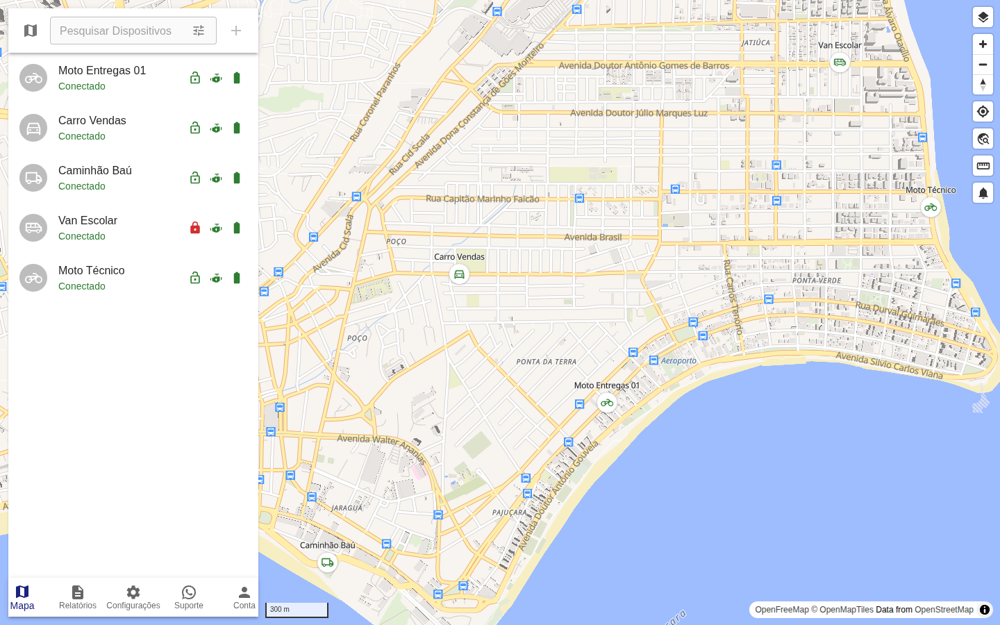
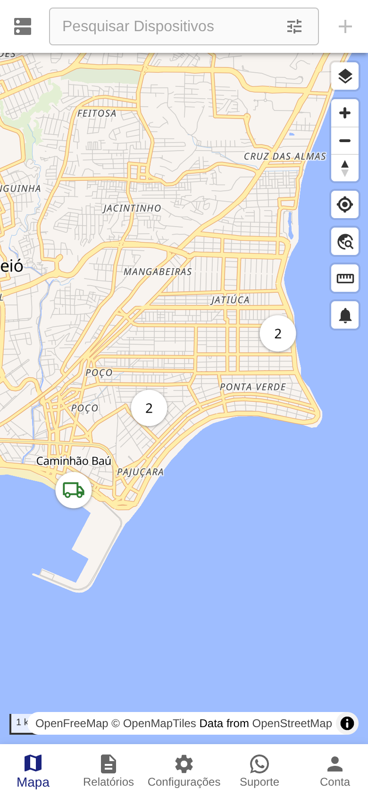
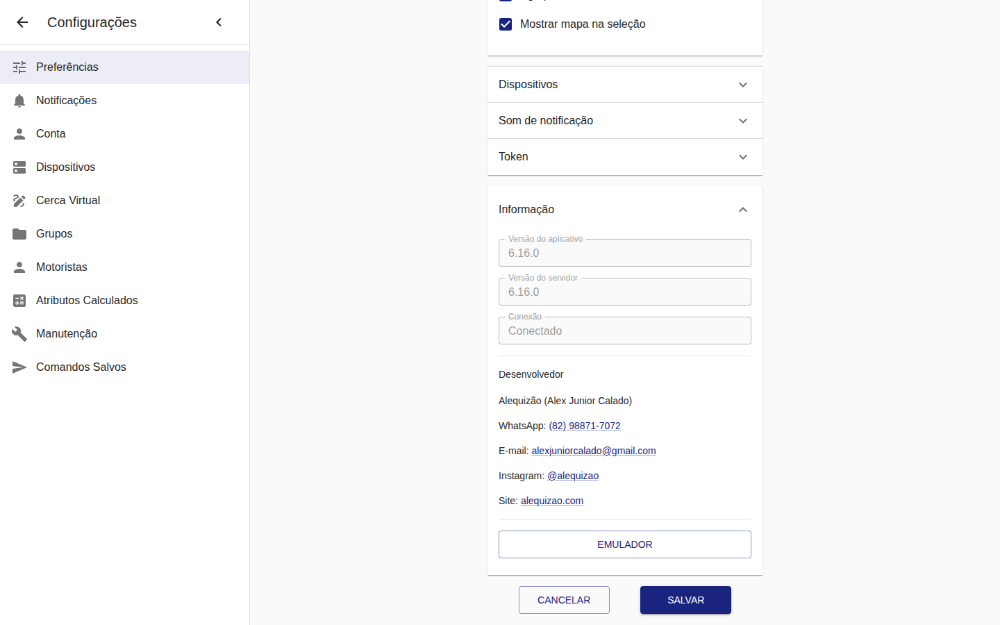
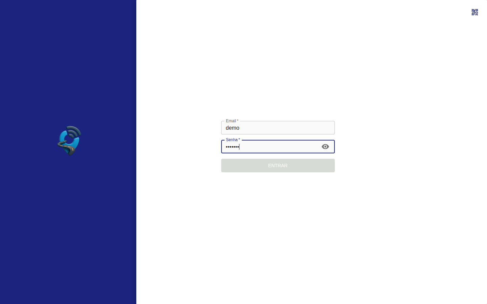
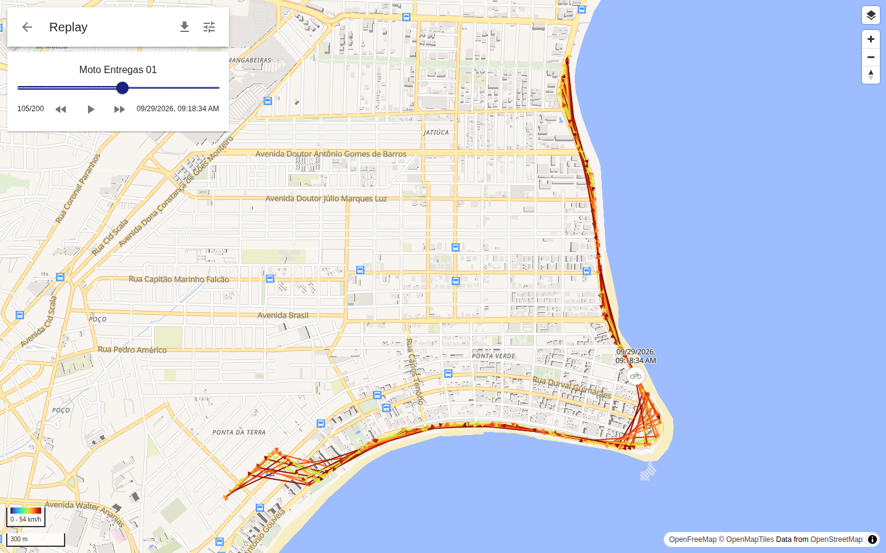
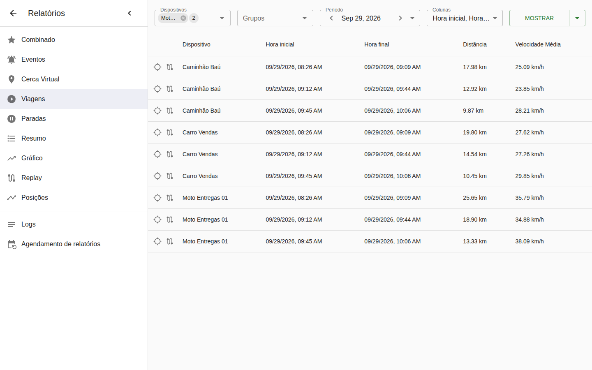

# 🛰️ Traccar Alequizão


Interface web personalizada do **[Traccar](https://www.traccar.org/)**, a plataforma open source de
rastreamento GPS. É a versão usada em produção no **[Monitoramento.top](https://monitoramento.top/)**:
o Traccar **oficial e completo** (servidor e web 6.16.0), com uma camada enxuta de personalizações.
Isso facilita acompanhar cada nova versão oficial sem perder nada.

## 📸 Telas do sistema

| Mapa com bloqueio/desbloqueio | Celular (menu com Suporte) |
|:---:|:---:|
|  |  |

| Preferências › Informação (desenvolvedor) | Login |
|:---:|:---:|
|  |  |

<details>
<summary>Mais telas</summary>

| Replay de rota | Relatórios |
|:---:|:---:|
|  |  |

</details>

> Os prints usam veículos e rotas **fictícios**, criados só para a demonstração.

## ✨ Personalizações

| Recurso | O que faz | Onde |
|---|---|---|
| 🔒 **Bloquear / desbloquear** | Cadeado em cada veículo da lista: verde = liberado, vermelho = bloqueado. Um toque envia `engineStop` / `engineResume` e guarda o estado em `attributes.uiLocked`. Fica desativado para usuários com a restrição *limitar comandos*. | `web/src/main/DeviceRow.jsx` |
| 💬 **Botão Suporte (WhatsApp)** | Item a mais no menu inferior (celular) que abre o WhatsApp de suporte. | `web/src/common/components/BottomMenu.jsx` |
| ⚙️ **`.env` em tempo de execução** | A web lê `/.env` antes de abrir. Hoje só há `SUPPORT_URL`, e dá para trocar o número sem recompilar. | `web/src/common/util/env.js`, `web/src/index.jsx` |
| 👨‍💻 **Dados do desenvolvedor** | Em *Preferências › Informação*: WhatsApp, e-mail, Instagram e site, com links clicáveis. | `web/src/settings/PreferencesPage.jsx` |
| 🎨 **Identidade visual** | Logos, favicon, ícones do PWA, `custom.css`/`custom.js`. | `personalizacoes/web/` |
| 🧭 **Central de Comandos** | Página `/comandos.html` com abas Enviar, Histórico e Fila, e comandos prontos para os rastreadores mais comuns. | `personalizacoes/web/comandos.html` |
| 🔎 **SEO** | Bloco JSON-LD (Organization) no `index.html`. | `personalizacoes/seo-jsonld.html` |
| 📴 **Service worker** | O PWA não põe `/comandos*` em cache. | `personalizacoes/sw-comandos-bypass.js` |

Para ver só o que mudou em relação ao Traccar oficial, compare os dois primeiros commits
(`Base oficial traccar-web 6.16.0` → `Personalizações Alequizão`).

## 📁 Estrutura

```
web/               código-fonte do traccar-web 6.16.0 + personalizações
personalizacoes/   arquivos estáticos copiados por cima do build
scripts/
  aplicar-web.sh        compila a web e instala numa pasta do Traccar
  atualizar-servidor.sh baixa o Traccar oficial e troca servidor + web
docs/img/          prints do README
```

## 🚀 Instalação e atualização

Requisitos: servidor Linux com o Traccar instalado (`/opt/traccar`), Node.js 22+ e `rsync`.

```bash
git clone https://github.com/alequizao/traccar-alequizao.git
cd traccar-alequizao

# só a interface web
sudo scripts/aplicar-web.sh /opt/traccar/web

# servidor oficial + interface (faça backup do banco antes)
sudo scripts/atualizar-servidor.sh 6.16.0 /opt/traccar
```

Mantidos entre versões: `conf/traccar.xml`, `data/` e `logs/`.

### Nova versão do Traccar

1. Pegue a tag nova do [traccar-web](https://github.com/traccar/traccar-web/tags) e substitua a pasta `web/`.
2. Reaplique o commit de personalizações (são poucos arquivos: veja a tabela acima).
3. `npm run build` para conferir e rode `scripts/atualizar-servidor.sh <versão>`.

### Configuração do servidor (`conf/traccar.xml`)

Chaves usadas em produção (os valores ficam só no servidor e **nunca** vão para o repositório):
`web.enableToken`, `web.cacheControl`, `geocoder.*` (Nominatim próprio, `pt-BR`), `database.*` (MySQL,
fuso `America/Maceio`), `notificator.types` (`web,mail,sms,firebase`), `sms.http.*` (gateway
WhatsApp) e `database.positionPeriod=0` (mostra no mapa veículos parados há mais de 90 dias).

## 🧾 Créditos e licença

Baseado no [Traccar](https://github.com/traccar/traccar) e no [traccar-web](https://github.com/traccar/traccar-web),
de Anton Tananaev, sob a **Apache License 2.0** (veja `LICENSE.txt`). As personalizações seguem a mesma licença.

## 👨‍💻 Desenvolvedor

Personalizado por **Alequizao**.

- **E-mail:** alequizao.dev@gmail.com
- **GitHub:** [@alequizao](https://github.com/alequizao)
- **Site:** [alequizao.com](https://alequizao.com/)
- **Instagram:** [@alequizao](https://instagram.com/alequizao)

Quer rastreamento com a sua marca? Entre em contato.
